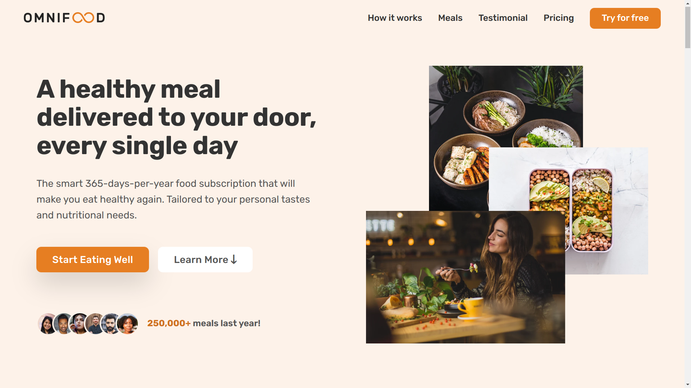

# OmniFood

## Description

Omnifood is a mock food delivery company's website. \
This project showcase responsive web design, intersection API and various web design principles.

## How to run the Project

Poject is live on [*THIS LINK*](https://siddhart-singh.github.io/OmniFood/).

### Technology

1. HTML, CSS
2. Javascript
3. Linux
4. [Git](https://git-scm.com/)
3. [Ion Icons](https://ionic.io/ionicons)
4. [Icons8](https://icons8.com/)
5. [Google Fonts](https://fonts.google.com/)

